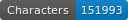
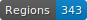
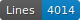

# FONDUE-MLT-PRINT-TEST

   

This repo contains the transcription various prints from several centuries in French (16th-21st c.) and several languages:
- Alsatian
- Italian
- Catalan
- Picard
- Occitan
- French creole language

## Content

## How to cite

Cf. [`htr-united.yml`](https://github.com/FoNDUE-HTR/FONDUE-MLT-PRINT-TEST/blob/main/htr-united.yml) file.

## Licences
Annotation is CC-BY. Images belong to the digital libraries.

 